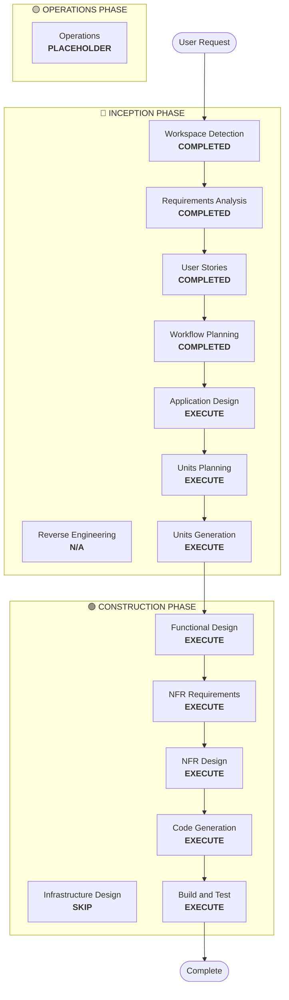

# Execution Plan - Ticket Anywhere

## Detailed Analysis Summary

### Change Impact Assessment
- **User-facing changes**: Yes. 建立全新的可視化任務管理介面，包含多模態輸入與智慧提醒。
- **Structural changes**: Yes. 需設計 Agentic 核心架構（意圖解析、規劃、執行、確認循環）。
- **Data model changes**: Yes. 需設計任務狀態、使用者偏好、行程包數據結構。
- **API changes**: No. (純前端應用，但涉及內部 Service 介面設計)。
- **NFR impact**: Yes. 需強制執行 Security Baseline (處理個資/訂位資訊) 與 PBT (資料解析邏輯)。

### Risk Assessment
- **Risk Level**: Medium. 主要是前端處理 OCR 與 NLP 的複雜度，以及多狀態任務的同步邏輯。
- **Rollback Complexity**: Easy. 純前端應用。
- **Testing Complexity**: Complex. 涉及多種輸入格式與邊界情況，需依賴 PBT 確保穩定性。

## Workflow Visualization

## Phases to Execute

### 🔵 INCEPTION PHASE
- [x] Workspace Detection (COMPLETED)
- [x] Reverse Engineering (N/A)
- [x] Requirements Analysis (COMPLETED)
- [x] User Stories (COMPLETED)
- [x] Execution Plan (IN PROGRESS)
- [ ] Application Design - **EXECUTE**
  - **Rationale**: 需定義核心元件架構（Intent Parser, Task Engine, UI Components）及其依賴關係。
- [ ] Units Planning - **EXECUTE**
  - **Rationale**: 將 10 個核心模組轉化為具體的實作單元，定義實作順序。
- [ ] Units Generation - **EXECUTE**
  - **Rationale**: 生成 10 個模組的程式碼框架與介面定義。

### 🟢 CONSTRUCTION PHASE
- [ ] Functional Design - **EXECUTE**
  - **Rationale**: 詳細設計各模組內部邏輯，特別是 Agentic 規劃與提醒算法。
- [ ] NFR Requirements & Design - **EXECUTE**
  - **Rationale**: 針對 Security Baseline 與 PBT 制定具體實作方案。
- [ ] Infrastructure Design - **SKIP**
  - **Rationale**: 本專案目前定位為純前端應用，使用標準 React 部署模式，無複雜雲端架構。
- [ ] Code Generation - **EXECUTE**
  - **Rationale**: 根據設計進行功能開發。
- [ ] Build and Test - **EXECUTE**
  - **Rationale**: 執行 PBT 測試與端對端驗證。

## Estimated Timeline
- **Total Phases**: 12 Stages (Inception 7 + Construction 5)
- **Estimated Duration**: 3-5 Development Cycles

## Success Criteria
- **Primary Goal**: 建立一個能透過多模態輸入自動管理行程、具備偏好記憶與人機確認機制的 Ticket Anywhere 網頁應用。
- **Key Deliverables**: 完整 React/TS 代碼庫、Security 審核報告、PBT 測試覆蓋報告。
- **Quality Gates**: 通過 Security Baseline 所有阻塞型規則，且核心純函數具備 PBT 覆蓋。
